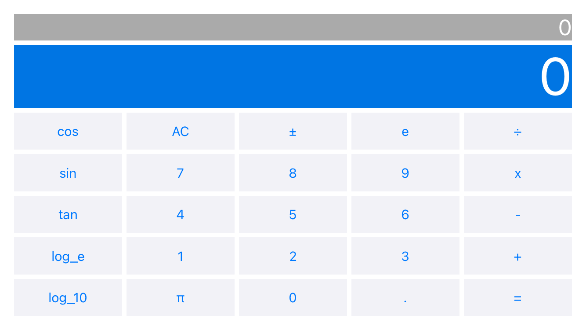

# Calculator

In this project, our aim was to develop a calculator that has some scientific mathematical operations. My calculator has 2 different UI according to device orientation like Apple's calculator. In portrait mode user can only see the basic operations(addition, division etc.) and in landscape mode user can see more complex mathematical operations. This application can be used on different devices which have different sizes like iPad Pro, iPhone 14 Pro and iPhone SE. 

Gif:

Different device screenshots are in below:

**iPhone 14:**

**iPhone SE:**

**iPad Pro:**

# Pazarama iOS Bootcamp - Hafta 2 - Ödev  
 
Bilimsel Hesap Makinesi  
Eğitimlerde üstünde çalıştığımız hesap makinesinin geliştirmesinin tamamlanması ve basit
hesap makinesinin, çeşitli fonksiyonlar eklenerek(karekök, üs alma vb.) bilimsel hesap
makinesine çevrilmesidir. Yapılan bir önceki matematiksel işlem hafızada tutulmalı ve
hesaplamaları yaptığımız label’in bir üstüne daha küçük bir label ekleyerek orada
gösterebiliriz. iPhone’da yer alan hesap makinesini dikkate alabilirsiniz. Tam bir bilimsel
hesap makinesi istemiyoruz. Kendi seçtiğiniz üç farklı özellik eklemeniz yeterli. Tabi bütün
özellikleri tanımlayabiliyorsanız deneyim açısından çok daha iyi olacaktır.  
Değerlendirme Kriterleri  
- Hesap makinesi uygulamasının sorunsuz çalışması.(Dört işlemi yapması ve iOS’da yer
alan hesap makinesine yakın bir deneyim sunması.)  
- En az üç adet bilimsel hesap makinesi özelliğinin eklenmesi.  
- Bir önceki işlemin displayLabel üstüne eklenecek daha küçük fontlu bir label ile
kullanıcıya gösterilmesi.  
iOS hesap makinesi. Solda dik(Portrait), sağda yatay(Landscape) görünüm.  
  
  
  PDF dosyasında görseller mevcuttur.
